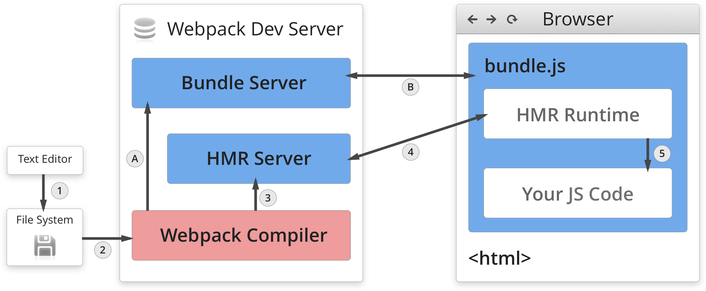
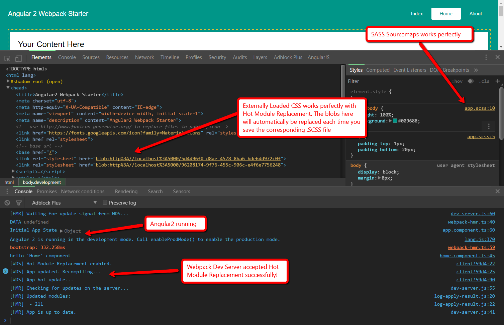

# Angular 2 ♥ .NET Core & Framework 
## Starter Project Featuring Webpack 2, JIT/AOT Compilation, TypeScript, & SASS

The purpose of the project is to assist Front-end developers and .NET developers to easily integrate their code. This documentation assumes you are developing on Windows 10, however it should work with little to no changes for Linux and Mac. It includes examples of how to integrate Angular 2 with .NET Core and .NET Framework.

This is based on the Angular 2 Webpack Starter repo [available on GitHub](https://angularclass.github.io/angular2-webpack-starter/). It enhances that repo with additional features, such as integration with .NET Core 1.0 as well as the original .NET Framework, Angular 2 with AOT Compilation, Webpack 2.1.0-beta.25, and SASS + Sourcemaps working with Hot Module Replacement.

In the following section, you'll learn what you need to know in order to build, serve, and edit this app.

## Getting Your Environment Setup

This project depends upon NodeJS and NPM. It is important that you only use **Node version 4.4.4 LTS or higher**, and **NPM version 3.10.6 or higher**. I do not recommend using the "Current" version which contains latest features, or you may run into build errors. Any other version of NodeJS and NPM is not guaranteed to work and may produce build errors.

**Installation steps:**

Install .NET Core SDK
 
* [https://www.microsoft.com/net/core#windows](https://www.microsoft.com/net/core#windows)

Run One Time Setup

* `npm run onetimesetup` (this will take between 3-10 minutes depending on your computer speed) 

**Webpack Dev Server with HMR (Hot Module Replacement) and Angular 2 JIT (Just In Time) compilation**
 
* `npm run build:dlls`
* `npm run devserver:jit`
* `npm run server:dotnetcore:dev` (reads js/css files from webpack-dev-server memory, on localhost:4000)

**Production Build /w AOT Compilation (No HMR, optimized code)**
 
* `npm run compile:aot`
* `npm run build:dlls`
* `npm run build:production:aot`
* `npm run server:dotnetcore:production` (reads js/css files from wwwroot disk folder, on localhost:5000)

**Production Build /w JIT Compilation (No HMR, optimized code)**

I wouldn't recommend JIT build for production code, because it's around 50% slower to bootstrap the app compared to AOT build. But here's how you do it in case you want to for some reason:
 
* `npm run build:dlls`
* `npm run build:production:jit`
* `npm run server:dotnetcore:production`

Viewing The App

* [http://localhost:5000](http://localhost:5000)
* Username: Admin (this will bypass the application authentication, the same as an "Authenticated: true" response from the server. No password needed)

**Important points of consideration**

* The project repo includes a .idea folder. This is for developing in IntelliJ IDEA 2016, which is excellent in my opinion for developing front end code. The project takes advantage of the `dotnet` command-line SDK which allows you to compile .NET code outside of Visual Studio 2015. 

* For IntelliJ IDEA 2016 users, there are many useful run configurations, including debugging the Webpack build, debugging the Angular 2 application, and compound run configurations which upon executing, will execute the above scripts in order for you, so you don't have to remember the order and run multiple commands each time.

* Of course, the app also works fine in Visual Studio 2015. However, the run configurations are not up to date, since I use IntelliJ for my main IDE. I will update them soon. You'll need to install `Task Runner Explorer` to execute the commands from within VS2015, otherwise you'll have to use a Terminal / Command Prompt. There is more information on how to use this starter with Visual Studio in [the getting started tips document.](./tools/docs/Tips.md)

* If you ever need to clean your project folder of any generated files, execute the "clean" task. This will remove everything within *"node_modules", "bower_components", "cache", "wwwroot" and "coverage"*.

* Alternatively you can execute "clean:install" which will perform the task `clean` followed by the task `install:all` which will redownload and reinstall all dependencies for you.

## Tips on getting started

Please view the [tips on getting started document](./tools/docs/Tips.md) to read some more information on getting started with this starterkit.

# Features of this Project

## Webpack

**For more info on Webpack Hot module Replacement (HMR), see: [Understanding Webpack Hot Module Replacement](http://andrewhfarmer.com/understanding-hmr/).**

This project uses Webpack to bundle all module dependencies into "bundles" of javascript. It is smart and knows how to resolve the dependencies during bundling by reading all the `require("somefile")` and `import { SomethingExported } from 'somewhere'` tags throughout your app. 

## Webpack Dev Server & Hot Module Replacement

In addition to Webpack, there is also a program called Webpack Dev Server (WDS) which runs and enables Hot Module Replacement (HMR). The above diagram explains how it works visually. HMR is a feature which allows you to launch your app, edit the source code, save, and webpack will automatically recompile the TypeScript, SASS, and all dependencies, then notify the Webpack Dev Server that a change happened. 

WDS will then notify the HMR runtime of the change, which is embedded inside the bundle.js loaded on the site. The HMR runtime receives this notification that a changed occured and it requests the new bundles associated with this change from the WDS. WDS then supplies those new "chunks" of code and "hot swaps" them out real-time while the app is running. Hot Module Replacement works for HTML, Javascript/TypeScript, or CSS/SASS/LESS/Whatever changes. 

The benefit of this is that you will not lose your app "state" nor your current app "view" each time you make a change to your source code, thereby allowing rapid development. However, keep in mind that you will likely lose your "local state" if you are working on source code that contains that particular local module. The reason for this is because when you save, webpack "disposes" of the old code and injects the new code to replace it, so any local states derrived from the code being swapped will be lost. 

**To use Hot Module Replacement is easy.**

1. First, make sure your webpack-dev-server is running on port 4000 (meaning either `devserver:jit` or `devserver:aot` is actively "running" with a final message of `[default] Ok, x.xxx sec.`). 

2. Then, simply make your changes to the source code, press save, and watch the page to see the magic happen. The changes you made will instantly reflect in the app real-time! For more detailed information of what is happening behind the scenes, view your browser's Developer Console for debugging output.

## Adding CSS/SCSS Styles to Angular2 Components With Lazy Loading

My goal was to enable a standard CSS development workflow wherein all styles are "externally" loaded via `<link href="" />` tags rather than embedded/inlined styles via `` tags in the `<head></head>`. The reason is because using embedded styles causes the source of the style to be hidden from the DevTools inspector. This was a big problem, because the default "Angular2 way" of loading styles within `@Component` results in the styles being embedded in the `<head></head>`, making it very difficult to know which css/scss file is applying the styles to a particular element. See image below.

In addition, I wanted Webpack Hot Module Replacement to still work, and because we're using SASS which compiles to CSS, I wanted to see the original .SCSS source-mapped file appear in the DevTools inspector, not the compiled .CSS file. Seeing the compiled .CSS is a step better, but it still forces the developer to have to "backtrack" the compiled .CSS to the original .SCSS. Sourcemaps solves this by directly displaying the original .SCSS source file in the Styles Pane, which you can click on and jump to the exact line in question within the original .SCSS file!

### How HMR with SASS Works

To properly get Hot Module Replacement working with SASS Sourcemaps and externally loaded (not inlined) CSS, we have to load our CSS/SCSS scripts OUTSIDE of the `@Component` decororator within the Angular2 component, NOT inside the `@Component` decorator. 

There is no disadvantage of doing this, nor is there an advantage to loading styles the "Angular2 way". In fact, the only thing that happens when loading styles the "Angular2 way" is that all styles are "inlined" within the `<head></head>` tag by default as a new `` tag, and therefore SASS sourcemaps don't work, and neither does Hot Module Replacement.

Another benefit is that loading styles this way enables so-called "Lazy Loading" of CSS/SCSS files "on demand" as the app views need them. Rather than loading up ALL of the entire app's styles at the initial app view when they are not even required (whether that's one giant externally loaded .CSS file or a large chunk of "embedded" styles), we can prevent this unnecessary cost on bandwidth and load time, and only load the exact styles each view needs, exactly when that view is loaded.

**Summary:** Do NOT add styles the "Angular2 Way" in the `@Component` decorator. That means do not add the `styles:` nor `styleUrls:` properties to the `@Component` decorators. You can simply require your SASS file directly above the `@Component` decorator with `require('./my.scss')`. 

**NOTE:** Make sure to include the correct path to the .SCSS file. By default, each component's TypeScript, HTML, and SASS all live together in the same folder. Now, webpack will automatically compile the SASS to CSS and append a `<link href="[hash-of]-my.scss" />` tag to the bottom of the `<head></head>`, which perfectly enables Hot Module Replacement, SASS Source Maps which clearly indicate the filename, and "Lazy-Loading" of styles on demand!

## NPM Scripting

**See [How To Use NPM As A Build Tool](http://blog.keithcirkel.co.uk/how-to-use-npm-as-a-build-tool/)
and [Why We Should Stop Using Grunt & Gulp](http://blog.keithcirkel.co.uk/why-we-should-stop-using-grunt/).**

NPM (Node Package Manager) is more than just a package manager. It is also a very robust Task Runner.

Instead of using Gulp, Grunt, Broccoli or any of the other Task Runners, I have opted to use NPM scripting for simplicity and time saving. Rather than having to write complex Gulp tasks or Grunt json, we can write simple NPM scripts in the form of Commands to the Command Line Interface (CLI), cmd.exe. Any command you could write on the Command Line, you can write as an NPM script. See package.json for examples. 

Every script has a `pre` and `post` version of it. For example, the task "projectlaunch" has a task called `preprojectlaunch` which will execute BEFORE `projectlaunch` will, even though we called "projectlaunch" first. Likewise, "postprojectlaunch" will execute AFTER `preprojectlaunch` and `projectlaunch`, in this order respectively. In this manner you can create complex chains of events will absolute ease. You also can use any native binary available to your local machine by either adding it to your global PATH or by changing your current working directory before executing a task with `cd C:/GoToThisFolder`. 

To run a task within another task, use "npm run (taskname)" where (taskname) is the name of another NPM script. 

To chain commands together on a single task without using `pre` or `post`, use the `&&` combiner. For example: `npm run clean && npm run install:all`. This will first run the `clean` task and once that task exits with code 0, it will run the `install:all` task.

NPM utilizing exit codes to indicate whether the executing task failed or succeeded. Exit code 0 is a success. Any non-zero exit code is a failure and will halt the scripting process, preventing any future scripts from running. You can debug the cause of the error by checking the NPM Task Runner Explorer console output. Each task you execute within NPM Task Runner Explorer is an instance of a new cmd.exe process running. Multiple tasks can run simultaneously if you double click on more than one.

**CAVEAT**: When chaining scripts together with `pre`, `post` or `&&`, they are all run **synchronously**, meaning that they happen sequentially in order, and if one fails, the rest will not execute. Therefore it is imperitive that all your scripts being executed issue an exit code 0 in order to continue scripting. 

**CAVEAT 2**: Webpack-Dev-Server is an ongoing task and does NOT have an exit code, because it stays alive. Therefore you cannot chain any tasks after running Webpack-Dev-Server without utilizing a workaround to get them to run **asynchronously**. There are also other NPM pacakges such as `concurrently` that can help with this, and command line tools such as chaining commands together with a single `&` and prefixing them with `start` to open each command in a new cmd.exe instance and run them in parallel).(`start npm run server:Frontend:hmr & start npm run apiserver`). 

## To-do

- [x] Integrating with Visual Studio
- [ ] Barebones version of the application containing just JWT-based Authentication
- [ ] More solid backend structure

## License
 [MIT](/LICENSE)
